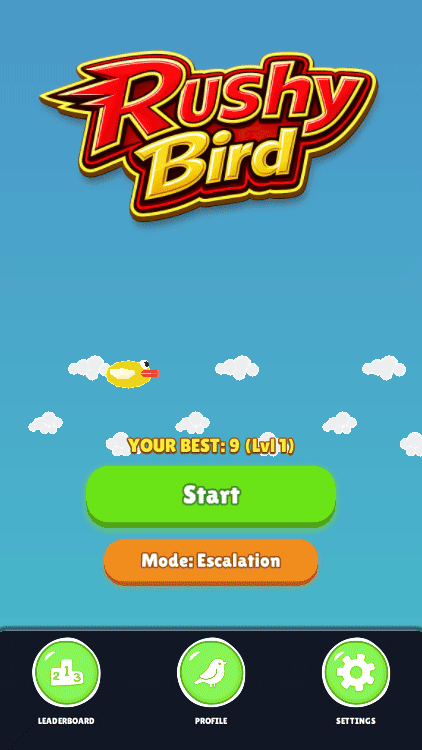

<h1 align="center">Rushy Bird</h1>

  

  This is my very first game development project! I've always wanted to explore game development, and I chose Godot as my first engine to learn the ropes. Rushy Bird is my first attempt at building something playable, learning how game programming works, and getting comfortable with Godot. It's a fast-paced, 2D arcade game featuring dynamic speed escalation, persistent high scores, and mobile-friendly touch controls. Developing a smooth game feel and a scaling speed mechanic was a fun challenge for my first project.

<h2 align="center">Gameplay Preview</h2>

  

# Input Controls

- **Keyboard (Desktop):** The **Spacebar** initiates jumps and menu navigation.
- **Touchscreen (Mobile):** Tapping the screen initiates jumps and menu navigation.

# Game Modes

Rushy Bird contains two game modes with independent high-score tracking.

## Classic Mode

- **Speed:** Static `1.0x` base speed.
- **Mechanics:** Constant velocity and spawning intervals with standard obstacle avoidance.

## Escalation Mode

- **Speed Scaling:** Asymptotic speed acceleration capped at a maximum of `2.5x` base speed.
- **Level Progression:**
  - Level duration starts at 30 seconds, incrementing by 5 seconds per level up to a maximum duration of 45 seconds.
  - Each level-up triggers a speed increase, a visual/audio alert, and a health refill (+1 heart).
- **Obstacle Spawning:**
  - Spawning interval scales down from `2.0s` to a minimum cap of `1.6s` as level increases.
  - Spawning interval acceleration rate is set to half of the game speed acceleration rate.
  - Y-axis obstacle offset randomness scales up to a maximum deviation of `8.5` by Level 5.
  - Maximum vertical distance difference between consecutive pipes is dynamically constrained based on current speed.
- **Health & Revive System:**
  - Runs initiate with 3 hearts (maximum capacity).
  - Pipe collisions deduct 1 heart, clear existing obstacles, and trigger a temporary invincibility (blink) state.
  - Ground or top boundary collisions result in instant death.
- **Physics Calibration:** Gravity scales quadratically with speed, capped at `2.0x` speed.
- **Score Multiplier:** Point values scale linearly as `current_level + 1`.

# Developer Console & Instrumentation

The game features an integrated **Developer Console** that pauses gameplay when opened and resumes when closed, facilitating settings adjustment, performance monitoring, and debugging.

## Console Interface & Controls

- **Desktop Activation:** Toggled using the **Tilde/Backtick key (`~` or `` ` ``)** during gameplay.
- **Mobile Activation (Touchscreens):** Toggled by tapping the **top-left corner of the screen 5 times** in quick succession.
- **Deactivation:** Dismissed using the **Escape (ESC)** key or by clicking/tapping outside the console input region.
- **Shortcuts & Navigation:**
  - **`Tab`**: Triggers autocomplete suggestions.
  - **`Up / Down Arrows`**: Cycles through entered command history.

## Key Console Commands

A full list of console commands can be queried using the `help` command. Primary commands include:

- **`help`**: Displays a quick reference guide of all available console commands.
- **`performance` / `perf`**: Toggles a real-time telemetry overlay at the top of the screen showing FPS, active game settings, and system diagnostics.
- **`status`**: Displays system statistics, active game state, network/authentication status, and cloud sync reports.
- **`gamemode [classic|escalation]`**: Queries or sets the active game mode.
- **`link`**: Opens the profile claiming/linking panel to associate the guest session with a permanent account.
- **`logout`**: Logs out of the current authenticated user session and returns to an anonymous guest profile.
- **`delete_guest [confirm]`**: Wipes local stats, deletes user data from all Firestore collections, and deletes the associated Firebase Auth account (requires typing `delete_guest confirm` to run).

_Note: Additional commands are available for audio controls (`volume`, `mute`), gameplay statistics (`stats`), debug utility commands (`levelup`, `heal`, `kill`, `timescale`, `profile`, `reset_guest`), and gameplay cheats._

# Development Setup

The source codebase is open for local compilation, modification, and execution. A hosted web build will be available for direct play on [itch.io](https://rzrabbi.itch.io/rushy-bird).

## Prerequisites

- **Godot Engine 3.x** (Version 3.6 is recommended) is required. Downloads are available via [the official Godot website](https://godotengine.org/download/archive/3.6-stable/).

## Workspace Configuration

- **Repository Cloning:** Source coordinates: `https://github.com/rzrabbi/rushy-bird.git`
- **Godot Project Import:** The project workspace is opened by importing the [project.godot](project.godot) settings file located at the root of the repository.
- **Firebase Configuration:** Local builds utilize a settings file named `.env` at the directory `res://addons/godot-firebase/.env` for credentials. The template layout is defined in [example.env](addons/godot-firebase/example.env).
- **Execution:** The default scene is run from the editor using the **Play** button or the `F5` hotkey.

# Leaderboards & Cloud Synchronization

Rushy Bird features real-time leaderboard tracking and persistent player profile synchronization. This system is integrated using a slightly customized version of the [GodotFirebase](https://github.com/GodotNuts/godot-firebase) addon (by Kyle Szklenski / GodotNuts), which interfaces with **Firebase Auth** and **Cloud Firestore** endpoints.

## Leaderboard Tracking

- **Eligible Mode:** Only scores achieved in **Escalation Mode** are submitted to the global leaderboards.
- **Dual Boards:** The game maintains two separate leaderboards:
  - **All-Time Leaderboard:** Tracks the highest scores achieved in the game since inception.
  - **Seasonal Leaderboard:** Resets automatically on the first day of each calendar month (tracked under monthly periods, e.g., `YYYY-MM`).
- **Read Request Caching:** To minimize Firestore document read consumption, `FirebaseManager` implements an in-memory cache. Subsequent leaderboard requests are served directly from the cached datasets unless a force-refresh is requested (such as after score submission) or an active fetch operation is already in progress.

## Firebase Cloud Storage & Profiles

The game leverages Firebase Authentication and Cloud Firestore to store and synchronize player profiles and leaderboard entries:

- **Anonymous Sessions:** When running the game for the first time, an anonymous Firebase session is created in the background. Players receive a unique Firebase UID allowing their scores, distance, playtime, and statistics to sync immediately without requiring any signup.
- **Profile Linking & Claiming:** Guest players can link/claim their profile using **Google Sign-In** or **Email/Password** credentials from the profile panel.
  - **Conflict Resolution:** If a player links a guest session to a permanent account that already has cloud data, the game prompts them to resolve the conflict by either overwriting the cloud data with guest progress, discarding the guest progress to load cloud data, or cancelling.
- **Firestore Collections Structure:**
  - `leaderboard_rushybird_alltime`: Stores public high scores mapping player names and scores to Firebase UIDs.
  - `leaderboard_rushybird_seasonal`: Identical to all-time, but stores monthly seasonal high scores segmented by the active time period.
  - `player_data_rushybird`: Stores detailed user statistics including total games, lifetime deaths, revives, distance, playtime, and mode-specific high scores.

## Firestore Security & Anti-Cheat Rules

To prevent cheating and protect leaderboard integrity, the database uses strict validation rules defined in [firestore.rules](firestore.rules):

- **Anti-Cheat Validation:** Score submissions are checked by the `isRealisticScore()` rule, enforcing that scores must be integers between 0 and 9,999 to reject impossible or hacked scores.
- **Level Validation:** Leaderboard submissions and player profile stats validate the level using the `isRealisticLevel()` rule, enforcing that the level must be an integer between 1 and 1,000 to reject impossible or hacked level stats.
- **Strict User Ownership:** Write operations (create, update, delete) are permitted only if the user is authenticated and writing to their own document (`request.auth.uid == userId`), preventing players from tampering with others' data.
- **Upward-Only Score Progress:** Leaderboard updates are only allowed if the new score is greater than or equal to the current high score (`request.resource.data.score >= resource.data.score`), preventing score resets.
- **Data Integrity Constraints:** Direct type and constraint validations are enforced, including character length limits (maximum 20 characters for player names) and specific data types for all properties.

## Firebase Guest Cleanup & Maintenance (GitHub Actions)

- **Firebase Auth Auto-Cleanup:** Automatically deletes anonymous/guest auth accounts older than 30 days via Firebase native settings.
- **Manual Firebase Guest Purge ([manual-firebase-guest-purge.yml](.github/workflows/manual-firebase-guest-purge.yml)):** Manual workflow (`workflow_dispatch`) to delete all anonymous guest accounts from Firebase Auth as well as their corresponding Firestore database documents, regardless of age.
- **Scheduled Firestore Database Pruning ([scheduled-firestore-pruning.yml](.github/workflows/scheduled-firestore-pruning.yml)):** Scheduled workflow running monthly (also manual-triggerable) to clean up Firestore documents (leaderboards/stats) of users whose accounts no longer exist in Firebase Authentication (due to guest account expiration or deletion).

## Local Configuration

- **Game Config:** Firebase authentication and project settings are read from `.env` located at `res://addons/godot-firebase/.env`. If this file is missing, execution falls back to offline mode with local save data. An [example.env](addons/godot-firebase/example.env) is included as a reference.
- **Export Packaging:** The `.env` configuration file is automatically packaged into the exported PCK archive during builds using the built-in non-resource export filters (`include_filter="*.env"`) defined in `export_presets.cfg`. This ensures Firebase configurations are securely bundled with the game binary for production exports without needing custom packaging scripts.

# Web Build & IFrame Considerations (e.g., itch.io)

When running the Web (HTML5) build inside an `iframe` on platforms like itch.io, certain browser security sandbox restrictions apply:

- **Keyboard Input on Mobile**: Native mobile virtual keyboards fail to trigger, display, or register key inputs correctly inside cross-origin iframes. To solve this, the project integrates the [Godot Onscreen Keyboard](https://github.com/martinfuchs/Godot-Onscreen-Keyboard) addon (customized by Tweaklab AG) to display an in-game virtual keyboard for input fields (`claim_email_input`, `claim_pass_input`, `name_input`, `game_over_name_input`).
  - **Mobile Detection**: Evaluates `navigator.userAgent` via `JavaScript.eval` to distinguish mobile web browsers from desktop web browsers.
  - **OS Keyboard Prevention**: Blocks native keyboards by setting focus mode to `Control.FOCUS_NONE` and disabling virtual keyboards (`virtual_keyboard_enabled = false`) on input fields, manually handling caret position and text manipulation.
  - **Platform Rules**:
    - **Mobile (Web HTML5)**: On-screen keyboard auto-activates by default (no toggle).
    - **Native Mobile (Android/iOS)**: On-screen keyboard is completely disabled to let native OS keyboard handle inputs.
    - **PC (Native Windows/Linux/Mac & Web PC)**: On-screen keyboard is disabled by default, but players can manually enable it via the "On-Screen Keyboard" settings toggle.
- **Disabled Google Login**: Google OAuth authentication popups do not function properly inside cross-origin iframes due to browser security restrictions. Therefore, Google Sign-In is disabled on Web builds, and players should use the Email/Password option to claim and link their accounts.
- **Web Audio Latency & Stuttering Fix**: Standard WebAssembly HTML5 exports in Godot 3.x often suffer from audio latency, stuttering, or absolute audio loss on browsers. To resolve this, the project integrates the [WebAudioExternal](https://github.com/probrain-dev/godot_web_external_audio_motor) addon. This addon runs Howler.js in the browser's main thread to fetch and play audio files via relative HTTP requests, avoiding WASM audio bottleneck issues. The integration is customized to support seamless native platform fallback (Windows/Android), clean up looped background tracks on scene reloads to prevent leaks, and map Godot's dB volume scales to natural logarithmic volume curves.

# Addon & Plugin Customizations

To support the game's requirements and resolve platform-specific issues, several third-party addons are integrated and customized:

## 1. [GodotFirebase (by Kyle Szklenski / GodotNuts)](https://github.com/GodotNuts/godot-firebase)

- **Project Requirement / Feature Supported**: Supports real-time leaderboard synchronization (both all-time and monthly seasonal), anonymous guest session management, and guest-to-permanent account linking.
- **Customizations**:
  - **Threaded Requests**: Enabled `use_threads = true` for non-web platforms in `Utilities.gd` and `auth.gd` to run network calls asynchronously, preventing the main thread from stuttering during heavy network operations.
  - **Token Refresh Protection**: Modified `begin_refresh_countdown()` to proactively refresh ID tokens 5 minutes prior to expiry. Integrated an incremental tracking timer ID (`_refresh_countdown_id`) to discard outdated timer yields on subsequent user login actions, preventing duplicate requests and rate-limiting errors.
  - **Redirect Order Correction**: Reordered TCP listener instantiation in `get_auth_localhost()` to start listening before launching the web browser OAuth redirect flow, ensuring the redirect response is not missed on high-speed clients.
  - **Account Deletion Flow Protection**: Assigned a unique request type flag (`99`) in `delete_user_account()` to bypass auto-refresh calls when a user deletes their guest account.
  - **Robust Type and Error Handling**: Added explicit type validation (`typeof(result[0]) != TYPE_INT`) inside `firestore.gd` to prevent game crashes from unhandled or malformed return values, gracefully resolving missing authentication states with structured error tasks.

## 2. [Godot Onscreen Keyboard (by martinfuchs / customized by Tweaklab AG)](https://github.com/martinfuchs/Godot-Onscreen-Keyboard)

- **Project Requirement / Feature Supported**: Allows mobile web players running inside cross-origin iframe environments (e.g., itch.io) to enter names and login credentials, bypassing browser security sandboxes that block native OS virtual keyboards.
- **Customizations**:
  - **Mobile Web Auto-Activation**: Added user-agent detection utilizing `JavaScript.eval` to distinguish mobile web browsers and auto-activate the virtual keyboard.
  - **OS Keyboard Prevention**: Disabled native virtual keyboard triggers on focused text fields (`virtual_keyboard_enabled = false` and `Control.FOCUS_NONE` focus mode) inside iframe environments to avoid duplicate inputs and let the custom UI keyboard handle inputs.
  - **Platform Selectivity**: Configured the keyboard to disable itself on native mobile builds (letting the OS native keyboard run) and remain manually toggleable in PC/web desktop environments.
  - **UI and Layout Enhancements**: Added an active field indicator label showing the target input and a "Switch Field" navigation button at the top of the panel to cycle between input fields, themed using Lilita and Roboto fonts.

## 3. [WebAudioExternal (by probrain-dev)](https://github.com/probrain-dev/godot_web_external_audio_motor)

- **Project Requirement / Feature Supported**: Eliminates high audio latency, stuttering, and absolute sound loss issues typical of Godot 3.x's built-in WASM audio backend in HTML5 web browsers.
- **Customizations**:
  - **Godot Wrapper System**: Implemented [WebAudioPlayer.gd](file:///d:/Projects/dev/game/rushy-bird-game/scripts/WebAudioPlayer.gd) to route play, stop, loop, and volume requests transparently to Howler.js on web targets while falling back to native `AudioStreamPlayer` nodes on PC and mobile clients.
  - **Preload Queuing**: Implemented a queuing system in `WebAudioPlayer.gd` that caches audio trigger requests during asset preloads and starts playback only when the setup signal (`loadedAllAudios`) completes.
  - **Finished Signal Mapping**: Connected Howler.js end-of-play callbacks to emit Godot's native `finished` signal, ensuring gameplay-restart sequences depending on sound completions proceed correctly without hanging.
  - **Memory Leak & Duplicate Cleanup**: Modified `initAudios()` in `audioEngine.js` to stop and unload existing Howl instances on scene reload, preventing duplicate overlapping BGM instances and memory leaks.
  - **Logarithmic Volume Curve**: Replaced linear volume approximations with a standard logarithmic decibel-to-linear conversion formula (`10^(dB/20)`) in `processVolume()`, extending down to `-80` dB (complete mute) to match Godot's native volume expectations.
  - **Dynamic File Formats**: Modified `audioEngine.js` to parse and maintain the audio file's original file extension (`.ogg` or `.wav`) instead of hardcoding `.mp3`.

# Special Thanks

A massive thank you to **Johnny Rouddro** for introducing me to the Godot Engine and game development in general. His guidance in setting up the project and helping write initial and early prototype code was invaluable to this first step of my journey.

Many thanks as well to **Borna Barua** for creating the fantastic art and assets for this game.
